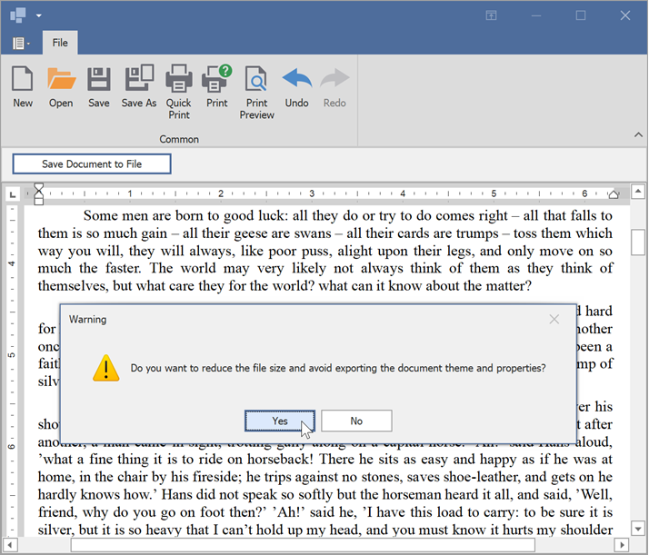

<!-- default badges list -->

<!-- default badges end -->

# How to: Save a Document in the RichEditControl

This example illustrates how to save a document in the RichEditControl and how to customize this process.

## Implementation Specifics

The [RichEditControl.BeforeExport](https://docs.devexpress.com/WindowsForms/DevExpress.XtraRichEdit.RichEditControl.BeforeExport) event is handled to reduce the size of an RTF file before it is saved. A warning message appears when you click the **Save Document to File** button. If you click **Yes**, the [RtfDocumentExporterOptions](https://docs.devexpress.com/OfficeFileAPI/DevExpress.XtraRichEdit.Export.RtfDocumentExporterOptions) properties are specified to reduce file size.

A custom [SaveDocumentAsCommand](https://docs.devexpress.com/OfficeFileAPI/DevExpress.XtraRichEdit.Commands.SaveDocumentAsCommand) command is used to customize the list of available formats in the dialog window.

## Files to Review

* [Form1.cs](./CS/SaveDocument/Form1.cs) (VB: [Form1.vb](./VB/SaveDocument/Form1.vb))
* [CustomCommand.cs](./CS/SaveDocument/CustomCommand.cs) (VB: [CustomCommand.vb](./VB/SaveDocument/CustomCommand.vb))

## More Examples

* [WinForms Rich Text Editor - Manage the Control Behavior in Code](https://github.com/DevExpress-Examples/winforms-richeditcontrol-common-api)

## Documentation

* [How to: Save a Document in the RichEditControl](https://docs.devexpress.com/WindowsForms/5889/controls-and-libraries/rich-text-editor/examples/files/how-to-save-a-document-in-the-rich-edit-control)
* [Import and Export](https://docs.devexpress.com/WindowsForms/9333/controls-and-libraries/rich-text-editor/import-and-export)
